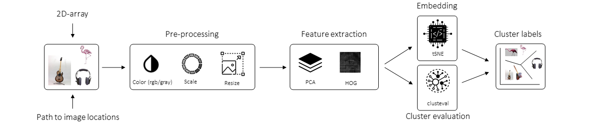

.. _code_directive:

-------------------------------------

Abstract
''''''''

**Background**

Image recognition is a computer vision task for identifying and verifying objects/persons on a photograph.
We can seperate the image recognition task into the two broad tasks, namely the supervised and unsupervised task.
In case of the supervised task, we have to classify an image into a fixed number of learned categories.
In case of the unsupervised task, we do not depend on the fact that training data is required but we can interpret the input data and find natural groups or clusters.

**Aim**

The aim of ``clustimage`` is to detect natural groups or clusters of images. It works using a multi-step proces of carefully pre-processing the images, extracting the features, and evaluating the optimal number of clusters across the feature space.
The optimal number of clusters are determined using well known methods suchs as *silhouette, dbindex, and derivatives* in combination with clustering methods, such as *agglomerative, kmeans, dbscan and hdbscan*.
With ``clustimage`` we aim to determine the most robust clustering by efficiently searching across the parameter and evaluation the clusters.
Besides clustering of images, the ``clustimage`` model can also be used to find the most similar images for a new unseen sample.

**Results**

``clustimage`` is Python package for unsupervised clustering of images after carefully pre-processing the images, extracting the features, and evaluating the optimal number of clustering in the high-dimensional feature space.
``clustimage`` does not depend on pre-trained neural networks that require many package-dependencies but is build on core statistics, such as Principal component analysis (PCA), and/or Histogram of Oriented Gradients (HOG).
The input for the model can be a NxM array for which each rows is a flattened rgb/gray image, or it can be a target directory or the full path to a list of images.
More advantages of ``clustimage`` is:

    * It can group any set of images on similarity.
    * It can determine the unique() images.
    * it can find similar images given an input image.
    * It is build on core statistics, such as PCA, HOG for feature extraction, and therefore it does not has a dependency block.
    * It does not require a learning proces.
    * It works out of the box.
    * It provides explainable results.
    * It provided many plots to improve understanding of the feature-space and sample-sample relationships.
    

Schematic overview
'''''''''''''''''''

The schematic overview of our approach is as following:

.. _schematic_overview:

.. raw:: html

	

	

		
	

	

