Mnist dataset
#####################

In this example we will load the mnist dataset and cluster the images.

Load dataset
********************************

.. code:: python

	# Load library
	import matplotlib.pyplot as plt
	from clustimage import Clustimage
	# init
	cl = Clustimage()
	# Load example digit data
	X = cl.import_example(data='mnist')

	print(X)
	# Each row is an image that can be plotted after reshaping:
	plt.imshow(X[0,:].reshape(8,8), cmap='binary')
	# array([[ 0.,  0.,  5., ...,  0.,  0.,  0.],
	#        [ 0.,  0.,  0., ..., 10.,  0.,  0.],
	#        [ 0.,  0.,  0., ..., 16.,  9.,  0.],
	#        ...,
	#        [ 0.,  0.,  0., ...,  9.,  0.,  0.],
	#        [ 0.,  0.,  0., ...,  4.,  0.,  0.],
	#        [ 0.,  0.,  6., ...,  6.,  0.,  0.]])
	# 

Cluster the images
********************************

.. code:: python

	# Preprocessing and feature extraction
	results = cl.fit_transform(X)

	# Lets examine the results.
	print(results.keys())

	# ['feat', 'xycoord', 'pathnames', 'filenames', 'labels']
	# 
	# feat      : Extracted features
	# xycoord   : Coordinates of samples in the embedded space.
	# filenames : Name of the files
	# pathnames : Absolute location of the files
	# labels    : Cluster labels in the same order as the input

Detect unique images
********************************

.. code:: python

	# Get the unique images
	unique_samples = cl.unique()
	# 
	print(unique_samples.keys())
	# ['labels', 'idx', 'xycoord_center', 'pathnames']
	# 
	# Collect the unique images from the input
	X[unique_samples['idx'],:]

	# Plot unique images. 
	cl.plot_unique()

.. |figM10| image:: ../figs/digits_unique.png
.. table:: Plot the unique images per cluster
   :align: center

   +-----------+
   | |figM10|  |
   +-----------+

Cluster evaluation
********************************

.. code:: python

	# Plot the explained variance
	cl.pca.plot()
	# Make scatter plot of PC1 vs PC2
	cl.pca.scatter(legend=False, label=False)
	# Plot the evaluation of the number of clusters
	cl.clusteval.plot()

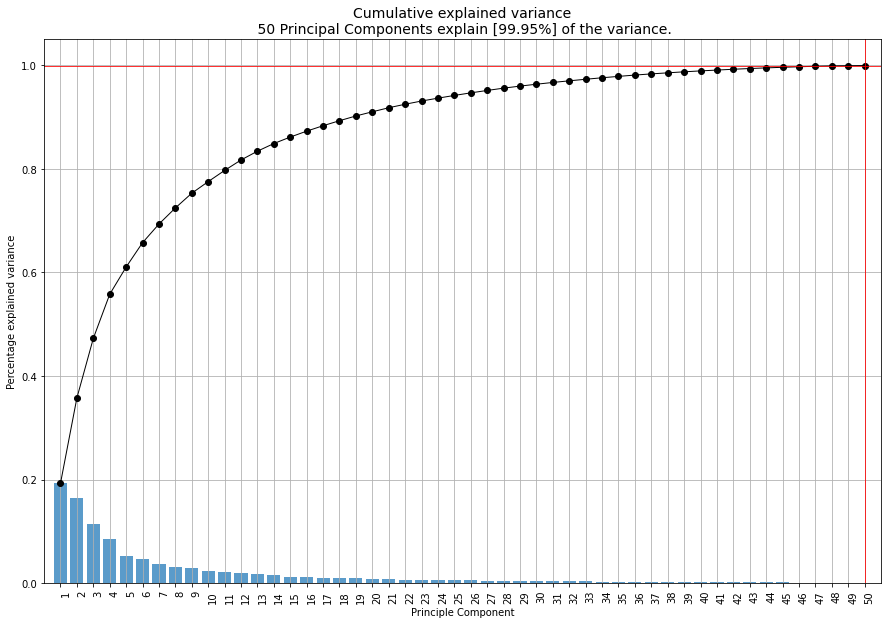
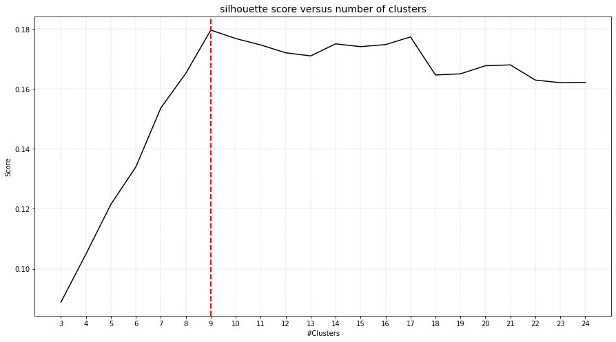
.. table:: Explained variance and Sillhouette score
   :align: center

   +----------+----------+
   | |figM7|  | |figM8|  |
   +----------+----------+

.. code:: python

	# Make silhouette plot
	cl.clusteval.scatter(cl.results['xycoord'])

.. |figM9| image:: ../figs/digits_fig1.png
.. table:: Sillhouette analysis results in 9 clusters.
   :align: center

   +----------+
   | |figM9|  |
   +----------+

Scatter plot
********************************

The scatterplot that is coloured on the clusterlabels. The clusterlabels should match the unique labels.
Cluster 1 contains digit 4, and  Cluster 5 contains digit 2, etc.

.. code:: python

	# Make scatterplot
	cl.scatter(zoom=None)

	# Plot the image that is in the center of the cluster
	cl.scatter(zoom=4)

	# Lets change some more arguments to make a pretty scatterplot
	cl.scatter(zoom=None, dotsize=200, figsize=(25, 15), args_scatter={'fontsize':24, 'gradient':'#FFFFFF', 'cmap':'Set2', 'legend':True})

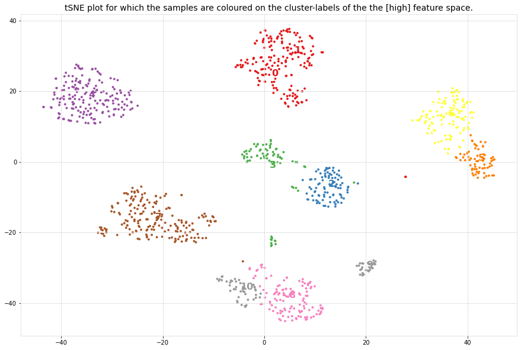
.. |figM2| image:: ../figs/digits_fig21_tsne.png
.. |figM12| image:: ../figs/digits_fig22_tsne.png
.. table:: Left: Scatter plot with cluster labels of all samples. Right: scatter plot with unique image in center.
   :align: center

   +----------+----------+
   | |figM1|  | |figM2|  |
   +----------+----------+
   |       |figM12|      |
   +----------+----------+

High resolution images where all mnist samples are shown.

.. code:: python

	cl.scatter(zoom=8, plt_all=True, figsize=(150,100))

.. |figM3| image:: ../figs/scatter_mnist_all.png
.. table:: Left: Scatter plot with cluster labels of all samples. Right: scatter plot with unique image in center.
   :align: center

   +----------+
   | |figM3|  |
   +----------+

Plot images detected in a cluster
************************************************

.. code:: python

	# Plot all images per cluster
	cl.plot(cmap='binary')

	# Plot the images in a specific cluster
	cl.plot(cmap='binary', labels=[1,5])

.. |figM4| image:: ../figs/digits_cluster1.png
.. |figM5| image:: ../figs/digits_cluster5.png
.. table:: Images that are detected in a particular cluster.
   :align: center

   +----------+----------+
   | |figM4|  | |figM5|  |
   +----------+----------+

Dendrogram
************************************************

.. code:: python

	# The dendrogram is based on the high-dimensional feature space.
	cl.dendrogram()

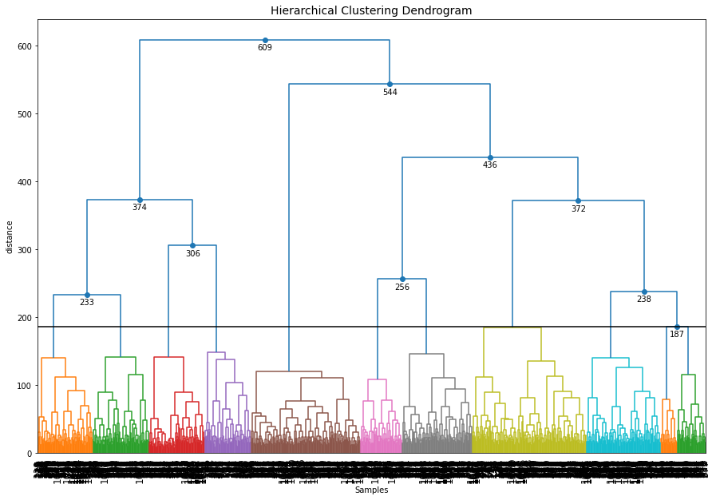
.. table:: Dendrogram of the mnist dataset
   :align: center

   +----------+
   | |figM6|  |
   +----------+

Caltech101 dataset
#####################

The documentation and docstrings readily contains various examples but lets make another one with many samples.
In this example, the **Caltech101** dataset will be clustered!
The pictures of objects belonging to 101 categories. About 40 to 800 images per category. Most categories have about 50 images. The size of each image is roughly 300 x 200 pixels.
Download the dataset over here: http://www.vision.caltech.edu/Image_Datasets/Caltech101/#Download

Cluster the images
********************************

.. code:: python

    from clustimage import Clustimage

    # init
    cl = Clustimage(method='pca', params_pca={'n_components':250})
    
    # Collect samples
    # Preprocessing, feature extraction and cluster evaluation
    results = cl.fit_transform('C://101_ObjectCategories//', min_clust=30, max_clust=60)
    
    # Try some other clustering (evaluation) approaches
    # cl.cluster(evaluate='silhouette', min_clust=30, max_clust=60)
    

Cluster evaluation
********************************

With ``clustimage`` we extracted the features that explained 89% of the variance. The optimal number of clusters of 49 (right figure).

.. code:: python

    # Evaluate the number of clusters.
    cl.clusteval.plot()
    cl.clusteval.scatter(cl.results['xycoord'])

.. |figE1| image:: ../figs/101_explainedvar.png
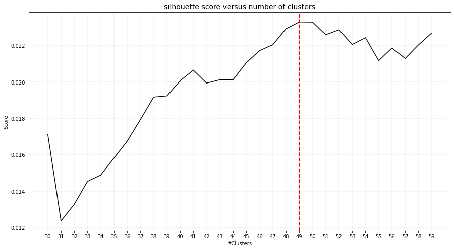
.. |figE3| image:: ../figs/101_silhouette_plot.png
.. table:: Left: Percentage explained variance. Right: Optimal number of clusters.
   :align: center

   +----------+----------+
   | |figE1|  | |figE2|  |
   +----------+----------+

Silhouette Plot
********************************

.. code:: python

    # Plot one of the clusters
    cl.plot(labels=40)
    
    # Plotting
    cl.dendrogram()

.. |figE30| image:: ../figs/101_silhouette_plot.png
.. table:: Silhouette plot
   :align: center

   +----------+
   | |figE30| |
   +----------+

Average image per cluster
********************************

For each of the detected clusters, we can collect the images and plot the image in the center (left figure), or we can average all images to a single image (right figure).

.. code:: python

    # Plot unique images. 
    cl.plot_unique()
    cl.plot_unique(img_mean=False)

.. |figE8| image:: ../figs/unique_mean_101.png
.. |figE9| image:: ../figs/unique_mean_101.png

.. table:: Left: Unique images gathered from the center of the cluster. Right: Averaged image of the cluster.
   :align: center

   +----------+----------+
   | |figE8|  | |figE9|  |
   +----------+----------+

Scatter plot
********************************

A scatter plot demonstrates the samples with its cluster labels (colors), and the average images per cluster.

.. code:: python

    # Scatter
    cl.scatter(dotsize=10, img_mean=False, zoom=None)
    cl.scatter(dotsize=10, img_mean=False)
    cl.scatter(dotsize=10)

.. |figE4| image:: ../figs/101_tsne_no_mean.png
.. |figE5| image:: ../figs/101_tsne.png
.. table:: Left: Unique images gathered from the center of the cluster. Right: Averaged image of the cluster.
   :align: center

   +----------+----------+
   | |figE4|  | |figE5|  |
   +----------+----------+

Plot images detected in a particular cluster
************************************************

.. |figE6| image:: ../figs/101_cluster40.png
.. |figE7| image:: ../figs/101_cluster.png
.. table:: Two examples of the clusters that are detected.
   :align: center

   +----------+----------+
   | |figE6|  | |figE7|  |
   +----------+----------+

Flower dataset
#####################

In this example we will load the flower dataset and cluster the images for which the path locations are on disk.

Load dataset
********************************

.. code:: python

	# Load library
	from clustimage import Clustimage

	# init
	cl = Clustimage(method='pca')
	
	# load example with flowers
	pathnames = cl.import_example(data='flowers')
	
	# The pathnames are stored in a list
	print(pathnames[0:2])
	# ['C:\\temp\\flower_images\\0001.png', 'C:\\temp\\flower_images\\0002.png']

Cluster the images
********************************

.. code:: python

	# Preprocessing, feature extraction and clustering.
	results = cl.fit_transform(pathnames)

The number of detected clusters looks pretty good because there is a high distinction between the peak for 5 clusters and the number of clusters that subsequently follow.

.. code:: python

	cl.clusteval.plot()
	cl.clusteval.scatter(cl.results['xycoord'])

.. |figF1| image:: ../figs/flowers_sil_vs_nrclusters.png
.. |figF2| image:: ../figs/flowers_silhouette.png
.. table:: Sillhouette score vs. number of clusters
   :align: center

   +----------+----------+
   | |figF1|  | |figF2|  |
   +----------+----------+

Detect unique images
********************************

.. code:: python

	# Plot unique images
	cl.plot_unique()
	cl.plot_unique(img_mean=False)

	# Plot all images per cluster
	cl.plot()

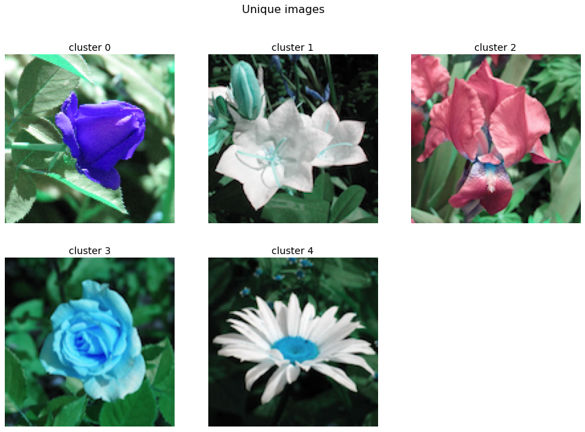
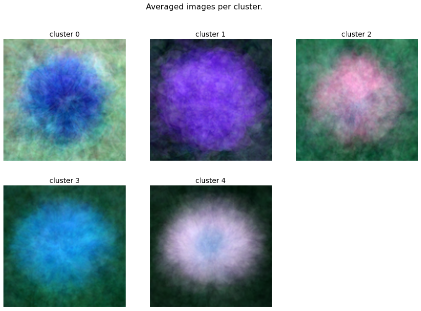
.. table:: Unique images per cluster
   :align: center

   +----------+----------+
   | |figF3|  | |figF4|  |
   +----------+----------+

Scatter plot
********************************

A scatter plot demonstrates the samples with its cluster labels (colors), and the average images per cluster.

.. code:: python

	# Scatter
	cl.scatter(dotsize=50, zoom=None)
	cl.scatter(dotsize=50, zoom=0.5)
	cl.scatter(dotsize=50, zoom=0.5, img_mean=False)
	cl.scatter(dotsize=50, zoom=0.5, img_mean=False)
	cl.scatter(zoom=1.2, plt_all=True, figsize=(150,100))

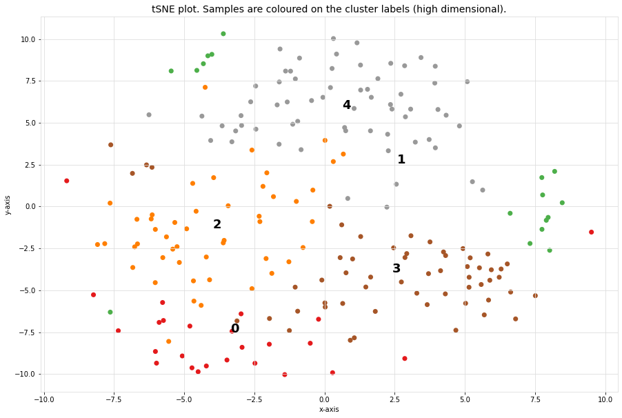
.. |figF7| image:: ../figs/flowers_scatter_imgs_mean.png
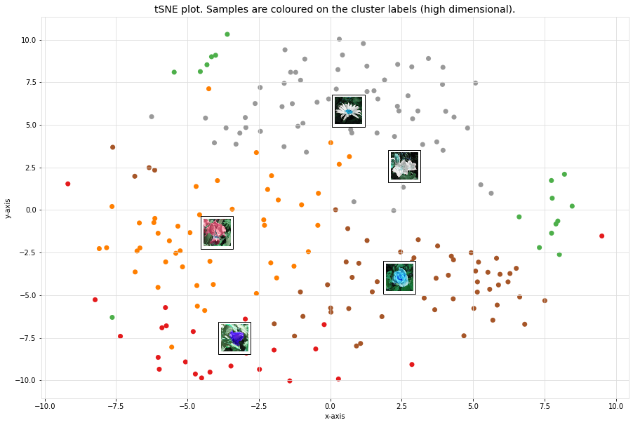
.. |figF9| image:: ../figs/flowers_predict_scatter_all.png
.. table:: Scatterplots
   :align: center

   +----------+----------+
   | |figF6|  | |figF7|  |
   +----------+----------+
   | |figF8|  | |figF9|  |
   +----------+----------+

Plot images detected in a particular cluster
************************************************

.. code:: python

	# Plot the images in a specific cluster
	cl.plot(labels=3)

.. |figF5| image:: ../figs/flowers_cluster3.png
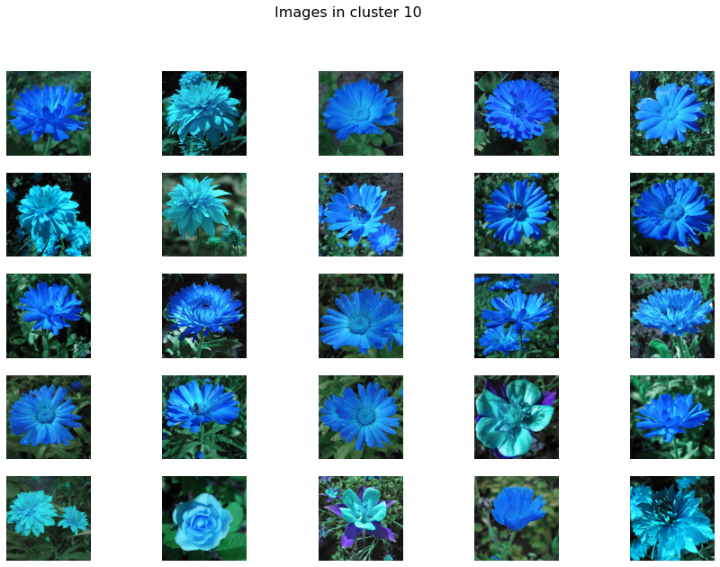
.. |figF11| image:: ../figs/flowers_plot2.png
.. |figF12| image:: ../figs/flowers_cluster3.png
.. table:: Images in various clusters
   :align: center

   +----------+
   | |figF5|  |
   +----------+
   | |figF10| |
   +----------+
   | |figF11| |
   +----------+
   | |figF12| |
   +----------+

Predict unseen sample
************************************************

Find images that are significanly similar as the unseen input image. 

.. code:: python

	results_find = cl.find(path_to_imgs[0:2], alpha=0.05)
	cl.plot_find()

	# Map the unseen images in existing feature-space.
	cl.scatter()

.. |figF13| image:: ../figs/flowers_predict_1.png
.. |figF14| image:: ../figs/flowers_predict_2.png
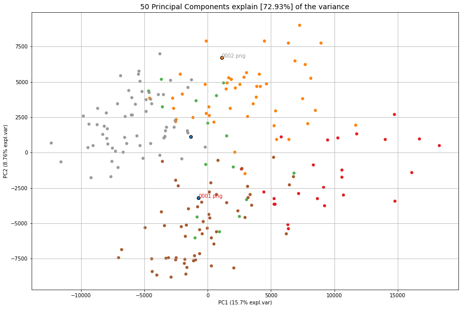
.. table:: Finding similar images as input image.
   :align: center

   +----------+
   | |figF13| |
   +----------+
   | |figF14| |
   +----------+
   | |figF15| |
   +----------+

Clustering of faces
########################################

.. code:: python

	from clustimage import Clustimage
	# Initialize with PCA
	cl = Clustimage(method='pca', grayscale=True)
	# Load example with faces
	X = cl.import_example(data='faces')
	# Initialize and run
	results = cl.fit_transform(X)

	# In case you need to extract the faces from the images
	# face_results = cl.extract_faces(pathnames)
	# The detected faces are extracted and stored in face_resuls. We can now easily provide the pathnames of the faces that are stored in pathnames_face.
	# results = cl.fit_transform(face_results['pathnames_face'])

	# Plot the evaluation of the number of clusters. As you can see, the maximum number of cluster evaluated is 24 can perhaps be too small.
	cl.clusteval.plot()
	# Lets increase the maximum number and clusters and run solely the clustering. Note that you do not need to fit_transform() anymore. You can only do the clustering now.
	cl.cluster(max_clust=35)
	# And plot again. As you can see, it keeps increasing which means that it may not found any local maximum anymore.
	# When looking at the graph, we see a local maximum at 12 clusters. Lets go for that
	cl.cluster(min_clust=4, max_clust=20)

	# Lets plot the 12 unique clusters that contain the faces
	cl.plot_unique()

	# Scatter
	cl.scatter(zoom=None)
	cl.scatter(zoom=0.2)

	# Make plot
	cl.plot(show_hog=True, labels=[1,7])

	# Plot faces
	cl.plot_faces()
	# Dendrogram depicts the clustering of the faces
	cl.dendrogram()

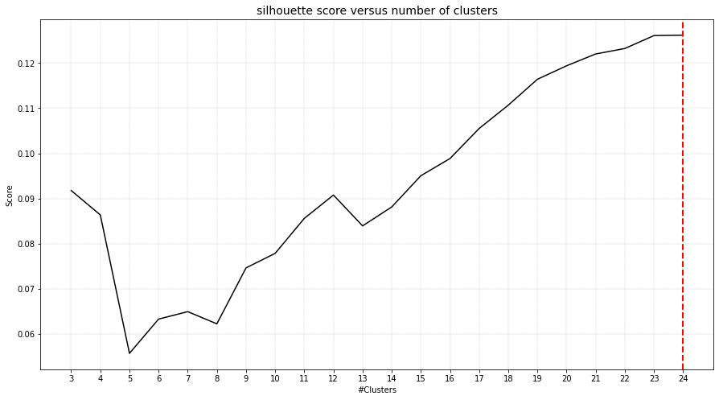
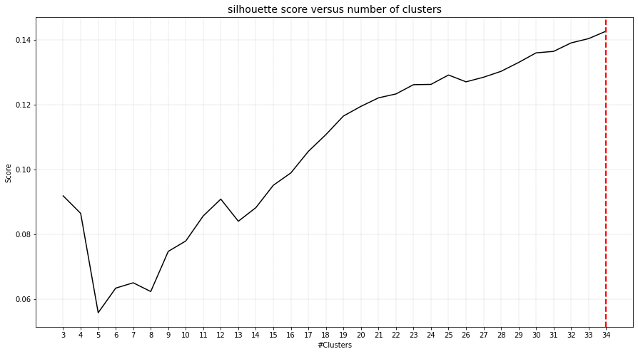

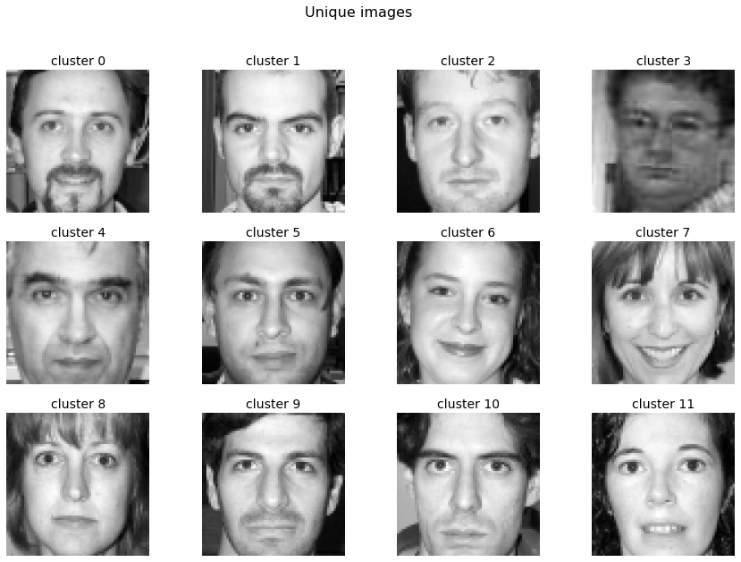
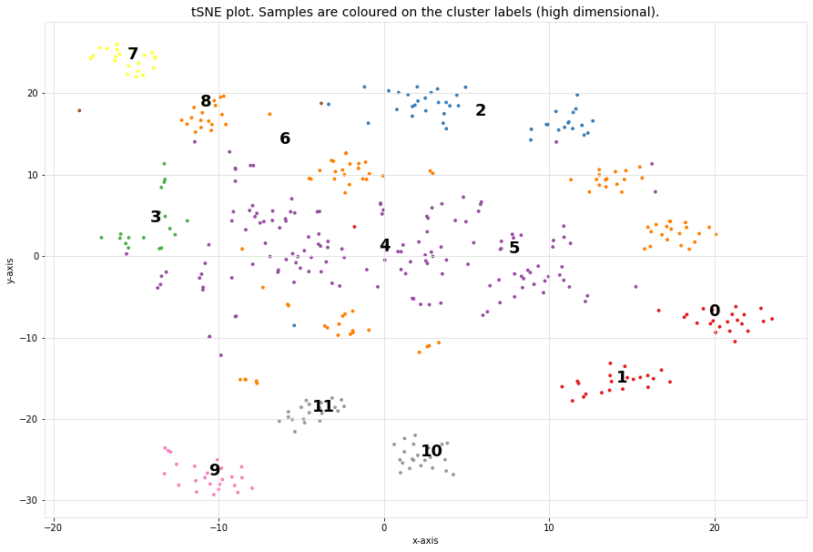

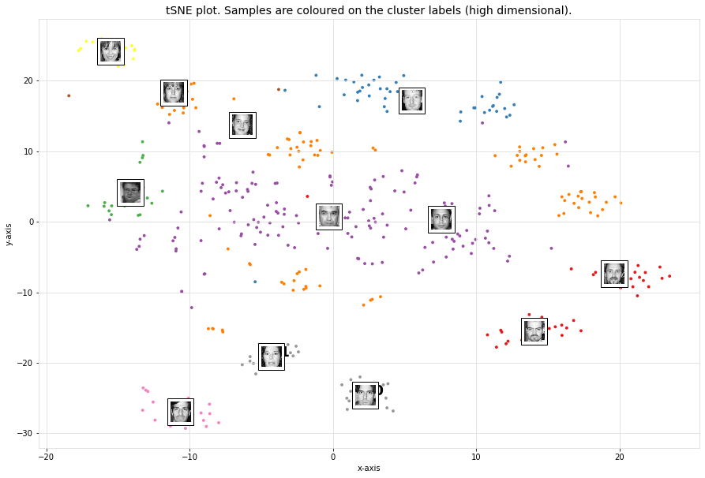
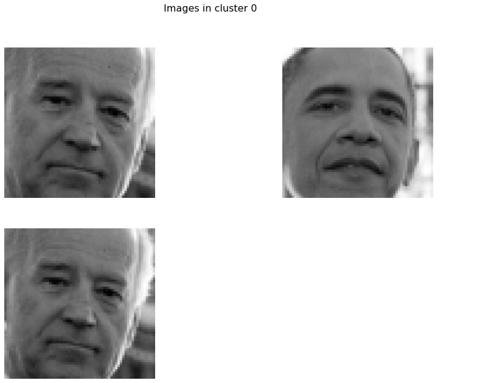

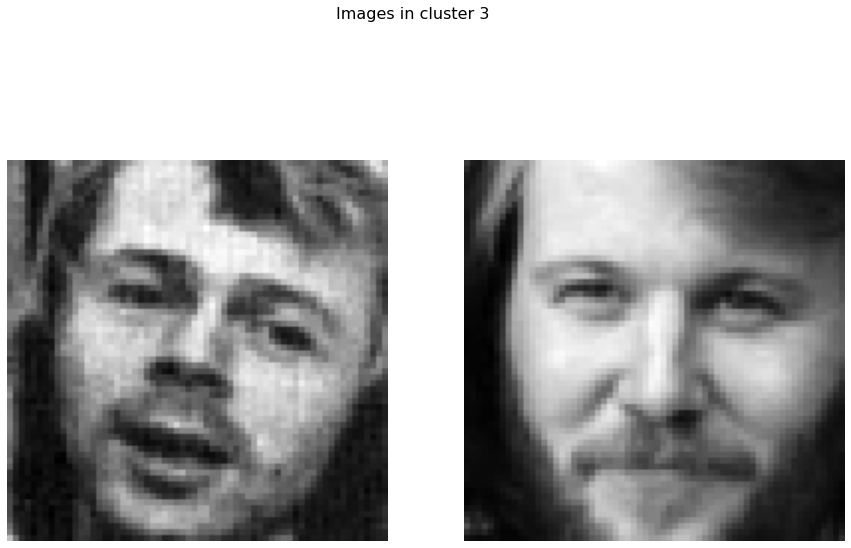
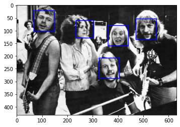

.. table:: Scatterplots
   :align: center

   +----------+----------+
   | |figG1|  | |figG2|  |
   +----------+----------+
   | |figG3|  | |figG4|  |
   +----------+----------+
   | |figG5|  | |figG6|  |
   +----------+----------+
   | |figG7|  | |figG8|  |
   +----------+----------+

Extract images belonging to clusters
########################################

.. code:: python

	# Import library
	from clustimage import Clustimage
	# Initialize
	cl = Clustimage(method='pca')
	# Import data
	pathnames = cl.import_example(data='flowers')
	# Cluster flowers
	results = cl.fit_transform(pathnames)

	# All results are stored in a dict:
	print(cl.results.keys())
	# Which is the same as:
	print(results.keys())

	dict_keys(['img', 'feat', 'xycoord', 'pathnames', 'labels', 'filenames'])

	# Extracting images that belong to cluster label=0:
	Iloc = cl.results['labels']==0
	cl.results['pathnames'][Iloc]

	# Extracting xy-coordinates for the scatterplot for cluster 0:
	import matplotlib.pyplot as plt
	xycoord = cl.results['xycoord'][Iloc]
	plt.scatter(xycoord[:,0], xycoord[:,1])

	# Plot the images for cluster 0:
	# Images in cluster 0
	imgs = np.where(cl.results['img'][Iloc])[0]
	# Make sure you get the right dimension
	dim = cl.get_dim(cl.results['img'][Iloc][0,:])
	# Plot
	for img in imgs:
	  plt.figure()
	  plt.imshow(img.reshape(dim))
	  plt.title()

Set image filenames using pandas dataframes
####################################################

In case a datamatrix is provided as an input to the model, the default setting is that random filenames are generated and stored in the tempdirectory. However, with a pandas dataframe as input you can provide the desired filenames by changing the index names!

.. code:: python

	from clustimage import Clustimage
	import pandas as pd
	import numpy as np

	# Initialize
	cl = Clustimage()

	# Import data
	Xraw = cl.import_example(data='mnist')
	
	# The Xraw datamatrix is numpy array for which the rows are the different images.
	print(Xraw)
	# array([[ 0.,  0.,  5., ...,  0.,  0.,  0.],
	#        [ 0.,  0.,  0., ..., 10.,  0.,  0.],
	#        [ 0.,  0.,  0., ..., 16.,  9.,  0.],
	#        ...,
	#        [ 0.,  0.,  1., ...,  6.,  0.,  0.],
	#        [ 0.,  0.,  2., ..., 12.,  0.,  0.],
	#        [ 0.,  0., 10., ..., 12.,  1.,  0.]])
	
	# Create some filenames
	filenames = list(map(lambda x: str(x) + '.png', np.arange(0, Xraw.shape[0])))
	# Store in a pandas dataframe
	Xraw = pd.DataFrame(Xraw, index=filenames)

	print(Xraw)
	#            0    1     2     3     4     5   ...   58    59    60    61   62   63
	# 0.png     0.0  0.0   5.0  13.0   9.0   1.0  ...  6.0  13.0  10.0   0.0  0.0  0.0
	# 1.png     0.0  0.0   0.0  12.0  13.0   5.0  ...  0.0  11.0  16.0  10.0  0.0  0.0
	# 2.png     0.0  0.0   0.0   4.0  15.0  12.0  ...  0.0   3.0  11.0  16.0  9.0  0.0
	# 3.png     0.0  0.0   7.0  15.0  13.0   1.0  ...  7.0  13.0  13.0   9.0  0.0  0.0
	# 4.png     0.0  0.0   0.0   1.0  11.0   0.0  ...  0.0   2.0  16.0   4.0  0.0  0.0
	#       ...  ...   ...   ...   ...   ...  ...  ...   ...   ...   ...  ...  ...
	# 1792.png  0.0  0.0   4.0  10.0  13.0   6.0  ...  2.0  14.0  15.0   9.0  0.0  0.0
	# 1793.png  0.0  0.0   6.0  16.0  13.0  11.0  ...  6.0  16.0  14.0   6.0  0.0  0.0
	# 1794.png  0.0  0.0   1.0  11.0  15.0   1.0  ...  2.0   9.0  13.0   6.0  0.0  0.0
	# 1795.png  0.0  0.0   2.0  10.0   7.0   0.0  ...  5.0  12.0  16.0  12.0  0.0  0.0
	# 1796.png  0.0  0.0  10.0  14.0   8.0   1.0  ...  8.0  12.0  14.0  12.0  1.0  0.0

	# Fit and transform the data
	results = cl.fit_transform(Xraw)
	
	# The index filenames are now used to store the images on disk.
	print(results['filenames'])
	# array(['0.png', '1.png', '2.png', ..., '1794.png', '1795.png', '1796.png'],

Import images from url location
##################################

Images can also be imported from url locations.
Each image is first downloaded and stored on a (specified) temp directory.
In this example we will download 5 images from url locations. Note that url images and path locations can be combined.

.. code:: python

	from clustimage import Clustimage

	# Initialize
	cl = Clustimage(method='pca', embedding='umap')

	# Importing the files files from disk, cleaning and pre-processing
	url_to_images = ['https://erdogant.github.io/datasets/images/flower_images/flower_orange.png',
			 'https://erdogant.github.io/datasets/images/flower_images/flower_white_1.png',
			 'https://erdogant.github.io/datasets/images/flower_images/flower_white_2.png',
			 'https://erdogant.github.io/datasets/images/flower_images/flower_yellow_1.png',
			 'https://erdogant.github.io/datasets/images/flower_images/flower_yellow_2.png']

	# Import into model
	X = cl.import_data(url_to_images)

	# Extract features using method
	Xfeat = cl.extract_feat(X)

	# Embedding
	xycoord = cl.embedding(Xfeat)

	# Cluster
	labels = cl.cluster()

	# Return
	results = cl.results

	# Make plots
	cl.plot()
	cl.dendrogram()

Breaking up the steps
########################################

Instead of using the all-in-one functionality: fit_transform(), it is also possible to break-up the steps.

.. code:: python

	from clustimage import Clustimage

	# Initialize
	cl = Clustimage(method='pca')

	# Import data
	Xraw = cl.import_example(data='flowers')
	Xraw = cl.import_example(data='mnist')
	Xraw = cl.import_example(data='faces')

	# Check whether in is dir, list of files or array-like
	X = cl.import_data(Xraw)

	# Extract features using method
	Xfeat = cl.extract_feat(X)

	# Embedding using tSNE
	xycoord = cl.embedding(Xfeat)

	# Cluster
	labels = cl.cluster()

	# Return
	results = cl.results

	# Or all in one run
	# results = cl.fit_transform(X)

	# Plots
	cl.clusteval.plot()
	cl.scatter()
	cl.plot_unique()
	cl.plot()
	cl.dendrogram()

	# Find
	results_find = cl.find(Xraw[0], k=0, alpha=0.05)
	cl.plot_find()

.. raw:: html

	

	

		
	

	

