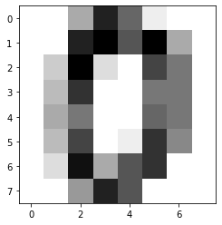
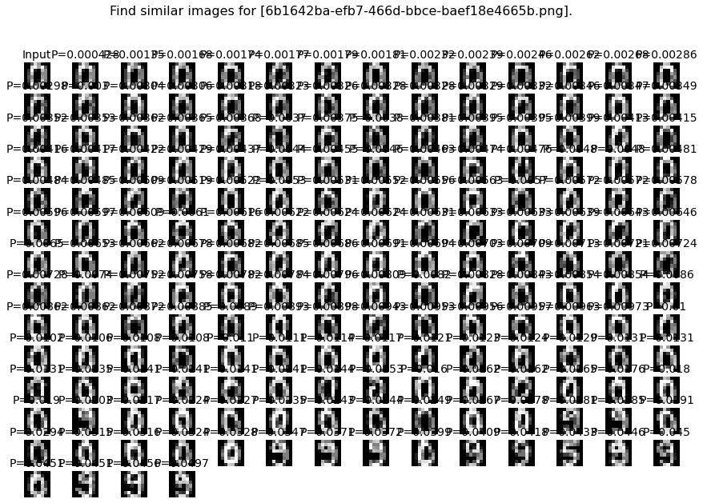

This section describes how to predict new unseen data points with a readily fitted model.

The ``find`` function :func:`clustimage.clustimage.Clustimage.find` allows to find images that are similar for what is readily being seen by the model. Finding images can be performed in two manners as described below. In both cases, the adjacency matrix is first computed using the distance metric (default Euclidean).

k-nearest neighbour
'''''''''''''''''''
The k-nearest neighbour approach searches the k nearest neighbours to that of the input image using the (default) Euclidean distance metric. This approach dus not return a P-value the distances to the closest neighbors. If case both *k* and *alpha* are specified, the union of detected samples is taken.

Example to find similar samples for an unseen dataset using k-nearest neighbour approach.

.. code:: python

	from clustimage import Clustimage
	import numpy as np

	# Init with default settings
	cl = Clustimage(method='pca')
	# load example with digits
	X = cl.import_example(data='mnist')

	# Make 1st subset
	idx = np.unique(np.random.randint(0,X.shape[0], 25))
	X1 = X[idx, :]
	X = X[np.setdiff1d(range(0, X.shape[0]), idx), :]

	# Cluster dataset X
	results = cl.fit_transform(X)
	# Results are also stored in object results
	cl.results.keys()
	# Scatter results
	cl.scatter(zoom=3, dotsize=50, figsize=(25, 15), legend=False, text=False)

	# Find images for 1st subset of images
	X1_results = cl.find(X1, k=5, alpha=None)
	# Make scatter
	cl.scatter(zoom=5, dotsize=100, text=False, figsize=(35, 20))

	# Print first key
	keys = list(X1_results.keys())[1:]
	print(X1_results.get(keys[0]).columns)
	# ['y_idx', 'distance', 'y_proba', 'labels', 'y_filenames', 'y_pathnames', 'x_pathnames']

	print(X1_results.get(keys[0])[['labels', 'distance','y_proba']])
	#    labels    distance  y_proba
	# 0       9  189.436546      NaN
	# 1       9  305.387050      NaN
	# 2       9  338.403554      NaN
	# 3       9  342.050496      NaN
	# 4       9  351.139465      NaN

	# Get most often seen class label for key
	for key in keys:
	    uiy, ycounts = np.unique(X1_results.get(key)['labels'], return_counts=True)
	    y_predict = uiy[np.argmax(ycounts)]
	    print('class:[%s] - %s' %(y_predict, key))

	# class:[9] - b2ea44d9-de55-421b-8bd1-6d13509533f5.png
	# class:[4] - 60dabaf0-7e1a-4c57-bb57-5d464fd2d8fb.png
	# class:[6] - dbc30522-5c83-4563-9c9f-40a86f24a091.png
	# class:[1] - deb11282-a992-4282-8212-ba62ef1e26fc.png
	# class:[3] - 29104a7c-775b-462f-84ba-e824c7c4b9c7.png
	# class:[9] - 45e6f5fd-4423-4743-850e-921914bfb9c9.png
	# class:[9] - 300a866e-5440-444a-b284-d2bfb1b1178b.png
	# class:[8] - 2dd0defc-d72a-4189-abae-bd33a94ee044.png
	# class:[7] - a308d13e-fa3e-4428-8b5e-edb26554d723.png
	# class:[2] - 6dc9c2b5-e1eb-4b6e-891a-db657c663013.png
	# class:[9] - 30477a7a-e7a0-44f2-8bb2-222719ebe12b.png
	# class:[5] - 50261737-f812-4665-b46f-cf8afb3cc88c.png
	# class:[0] - c83ab55a-2983-44a6-9e2e-4964dc13c1b0.png
	# class:[9] - 3eafd007-b6ed-4d17-a9db-3477854525df.png
	# class:[8] - 411c207e-4804-4e30-a1c5-546876e36c51.png
	# class:[4] - 661ac0f2-6f41-493a-bb3a-2c068c632d86.png
	# class:[9] - 9fc65ef1-ff93-4ac6-9cdb-f4605ee9661a.png
	# class:[7] - 6d9e017e-fc6a-424f-8f40-52995db771dc.png
	# class:[4] - dfc5cf51-2157-437f-b1ce-920100b74119.png
	# class:[4] - 507c365d-d35d-4623-985a-e9512c511d11.png
	# class:[0] - 058f3759-2608-490e-ac79-e5fde8d10f7e.png
	# class:[2] - a10dbae8-81f1-4613-8fd9-0bfa4815f1ad.png
	# class:[2] - a889af11-961c-42f6-8b34-3d0f7050c34c.png
	# class:[0] - 2e92d26c-3bf4-4c25-9d7e-4ceaa2e06d69.png
	# class:[4] - b7706e78-c653-4e26-9d7a-bcb512751526.png

Probability density fitting
'''''''''''''''''''''''''''
The probability density fitting method fits a model on the input features to determine the loc/scale/arg parameters across various theoretical distribution. In case of PCA, these are the principal components. The tested disributions are *['norm', 'expon', 'uniform', 'gamma', 't']*. The fitted distribution is the similarity-distribution of samples.

For each new (unseen) input image, the probability of similarity is computed across the images, and images with P <= *alpha*(lower bound) are returned. Note that the metric can be changed in this function but this may lead to confusions as the results will not intuitively match with the scatter plots as these are determined using metric in the fit_transform() function.

Example to find similar samples for an unseen dataset using probability density fitting.

.. code:: python

	from clustimage import Clustimage
	import numpy as np

	# Init with default settings
	cl = Clustimage(method='pca')
	# load example with digits
	X = cl.import_example(data='mnist')

	# Make 1st subset
	idx = np.unique(np.random.randint(0,X.shape[0], 25))
	X1 = X[idx, :]
	X = X[np.setdiff1d(range(0, X.shape[0]), idx), :]

	# Cluster dataset X
	results = cl.fit_transform(X)
	# Results are also stored in object results
	cl.results.keys()
	# Scatter results
	cl.scatter(zoom=3, dotsize=50, figsize=(25, 15), legend=False, text=False)

	# Find images for 1st subset of images
	X1_results = cl.find(X1, alpha=0.05)
	# Make scatter
	cl.scatter(zoom=5, dotsize=100, text=False, figsize=(35, 20))

	# Print first key
	keys = list(X1_results.keys())[1:]
	print(X1_results.get(keys[0]).columns)
	# ['y_idx', 'distance', 'y_proba', 'labels', 'y_filenames', 'y_pathnames', 'x_pathnames']
	print(X1_results.get(keys[0])[['labels', 'distance','y_proba']])

	#     labels    distance   y_proba
	# 0        8  189.373756  0.000035
	# 1        8  305.290164  0.000822
	# 2        8  338.588849  0.001812
	# 3        8  341.933366  0.001956
	# 4        8  351.231864  0.002412
	# ..     ...         ...       ...
	# 57       8  506.617886  0.044141
	# 58       8  507.522983  0.044750
	# 59       8  508.852247  0.045657
	# 60       8  509.517201  0.046116
	# 61       8  511.862011  0.047765

	# Get most often seen class label for key
	for key in keys:
	    uiy, ycounts = np.unique(X1_results.get(key)['labels'], return_counts=True)
	    y_predict = uiy[np.argmax(ycounts)]
	    print('class:[%s] - %s' %(y_predict, key))

	# class:[9] - b2ea44d9-de55-421b-8bd1-6d13509533f5.png
	# class:[4] - 60dabaf0-7e1a-4c57-bb57-5d464fd2d8fb.png
	# class:[6] - dbc30522-5c83-4563-9c9f-40a86f24a091.png
	# class:[1] - deb11282-a992-4282-8212-ba62ef1e26fc.png
	# class:[3] - 29104a7c-775b-462f-84ba-e824c7c4b9c7.png
	# class:[9] - 45e6f5fd-4423-4743-850e-921914bfb9c9.png
	# class:[9] - 300a866e-5440-444a-b284-d2bfb1b1178b.png
	# class:[8] - 2dd0defc-d72a-4189-abae-bd33a94ee044.png
	# class:[7] - a308d13e-fa3e-4428-8b5e-edb26554d723.png
	# class:[2] - 6dc9c2b5-e1eb-4b6e-891a-db657c663013.png
	# class:[9] - 30477a7a-e7a0-44f2-8bb2-222719ebe12b.png
	# class:[5] - 50261737-f812-4665-b46f-cf8afb3cc88c.png
	# class:[0] - c83ab55a-2983-44a6-9e2e-4964dc13c1b0.png
	# class:[9] - 3eafd007-b6ed-4d17-a9db-3477854525df.png
	# class:[8] - 411c207e-4804-4e30-a1c5-546876e36c51.png
	# class:[4] - 661ac0f2-6f41-493a-bb3a-2c068c632d86.png
	# class:[9] - 9fc65ef1-ff93-4ac6-9cdb-f4605ee9661a.png
	# class:[7] - 6d9e017e-fc6a-424f-8f40-52995db771dc.png
	# class:[4] - dfc5cf51-2157-437f-b1ce-920100b74119.png
	# class:[4] - 507c365d-d35d-4623-985a-e9512c511d11.png
	# class:[0] - 058f3759-2608-490e-ac79-e5fde8d10f7e.png
	# class:[2] - a10dbae8-81f1-4613-8fd9-0bfa4815f1ad.png
	# class:[2] - a889af11-961c-42f6-8b34-3d0f7050c34c.png
	# class:[0] - 2e92d26c-3bf4-4c25-9d7e-4ceaa2e06d69.png
	# class:[4] - b7706e78-c653-4e26-9d7a-bcb512751526.png

More examples
'''''''''''''

.. code:: python

	from clustimage import Clustimage
	import matplotlib.pyplot as plt
	import pandas as pd

	# Init with default settings
	cl = Clustimage(method='pca')

	# load example with digits
	X = cl.import_example(data='mnist')

	# Cluster digits
	results = cl.fit_transform(X)

	# Lets search for the following image:
	plt.figure(); plt.imshow(X[0,:].reshape(cl.params['dim']), cmap='binary')

	# Find images
	results_find = cl.find(X[0:3,:], k=None, alpha=0.05)

	# Show whatever is found. This looks pretty good.
	cl.plot_find()
	cl.scatter(zoom=3)

	# Extract the first input image name
	filename = [*results_find.keys()][1]

	# Plot the probabilities
	plt.figure(figsize=(8,6))
	plt.plot(results_find[filename]['y_proba'],'.')
	plt.grid(True)
	plt.xlabel('samples')
	plt.ylabel('Pvalue')

	# Extract the cluster labels for the input image
	results_find[filename]['labels']

	# The majority of labels is for class 0
	print(pd.value_counts(results_find[filename]['labels']))
	# 0    171
	# 7      8
	# Name: labels, dtype: int64

.. |figCF2| image:: ../figs/find_in_pca.png
.. |figCF3| image:: ../figs/find_proba.png

.. table:: Find results for digits.
   :align: center

   +----------+----------+
   | |figCF1| | |figCF2| | 
   +----------+----------+
   | |figCF3| | |figCF4| | 
   +----------+----------+

** Example to find similar images based on the pathname as input.**

.. code:: python

        from clustimage import Clustimage

        # Init with default settings
        cl = Clustimage(method='pca')

        # load example with flowers
        pathnames = cl.import_example(data='flowers')

        # Cluster flowers
        results = cl.fit_transform(pathnames[1:])
        
        # Lets search for the following image:
        img = cl.imread(pathnames[10], colorscale=1)
        plt.figure(); plt.imshow(img.reshape((128,128,3)));plt.axis('off')

        # Find images
        results_find = cl.find(pathnames[10], k=None, alpha=0.05)

        # Show whatever is found. This looks pretty good.
        cl.plot_find()
        cl.scatter()

.. |figCF5| image:: ../figs/find_flowers.png
.. |figCF6| image:: ../figs/find_flowers_scatter.png

.. table:: Find results for the flower using pathname as input.
   :align: center

   +----------+----------+
   | |figCF5| | |figCF6| | 
   +----------+----------+
   

.. _clusteval: https://github.com/erdogant/clusteval

.. raw:: html

	

	

		
	

	

